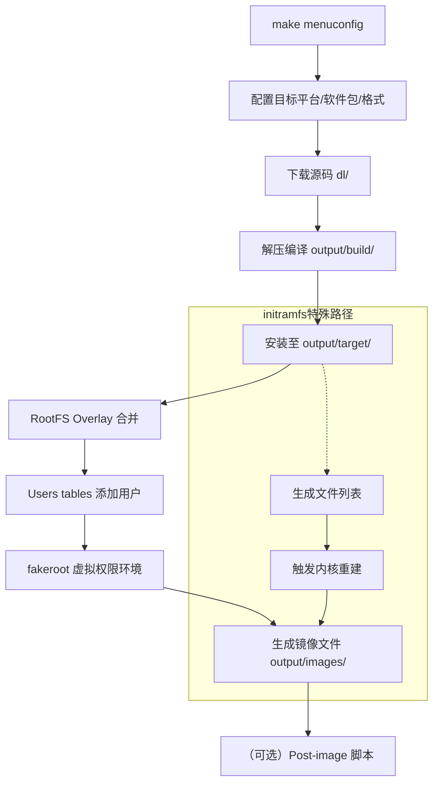

- [buildroot work flow](#buildroot-work-flow)
  - [一、构建基础骨架：从“毛坯房”开始](#一构建基础骨架从毛坯房开始)
  - [二、填充内容：编译并安装软件包](#二填充内容编译并安装软件包)
  - [三、用户定制化：加“私货”的三种手段](#三用户定制化加私货的三种手段)
  - [四、虚拟根权限环境：fakeroot](#四虚拟根权限环境fakeroot)
  - [五、生成最终镜像：一鱼多吃](#五生成最终镜像一鱼多吃)
  - [六、特殊场景：initramfs 的“二次构建”](#六特殊场景initramfs-的二次构建)
  - [七、流程图](#七流程图)
  - [八、综上所述](#八综上所述)
    - [特殊情况：initramfs / initrd](#特殊情况initramfs--initrd)
- [镜像打包工具的行为](#镜像打包工具的行为)
- [内核编译在 Buildroot 中的角色](#内核编译在-buildroot-中的角色)
  - [内核编译是 Buildroot 工作的一部分吗？](#内核编译是-buildroot-工作的一部分吗)
    - [1. 内核编译是可选但重要的功能](#1-内核编译是可选但重要的功能)
    - [2. 完整的内核管理](#2-完整的内核管理)
    - [3. 内核作为普通包](#3-内核作为普通包)
  - [只有在 initramfs 场景下，和 kernel make 结合使用吗？](#只有在-initramfs-场景下和-kernel-make-结合使用吗)
    - [1. 常规内核编译](#1-常规内核编译)
    - [2. initramfs 特殊场景](#2-initramfs-特殊场景)
  - [关键区别](#关键区别)
  - [总结](#总结)

# buildroot work flow

## 一、构建基础骨架：从“毛坯房”开始
Buildroot首先需要一个最原始的根文件系统目录结构。

操作：将 system/skeleton/ 目录下的内容完整拷贝到 output/target/ 。

实质：skeleton是一个最小化的根目录框架，包含 /bin、/dev、/etc、/lib、/usr 等基础目录，以及最基本的配置文件（如passwd、profile、fstab）。这是所有后续构建的起点。

用户可干预：你可以通过配置 BR2_ROOTFS_SKELETON_CUSTOM 使用自己的骨架，但绝大多数场景保持默认

## 二、填充内容：编译并安装软件包
这是Buildroot的核心耗时环节。流程如下：

下载源码：根据menuconfig选中的软件包列表，从指定服务器下载源码包，存放于 dl/ 目录 。

解压编译：源码解压至 output/build/，每个软件包在此目录下完成交叉编译 。

安装至target：编译生成的二进制文件、库文件、配置文件、手册等，通过make install步骤，拷贝进 output/target/ 的对应位置 。

关键点：

工具链的动态库（如glibc或uClibc）也会从output/staging/拷贝至output/target/lib 。

系统启动脚本（如/etc/init.d/rcS）由package/initscripts/提供，同样在此阶段安装 。

构建顺序由依赖关系自动管理。

## 三、用户定制化：加“私货”的三种手段
纯粹的Buildroot构建可能缺少你自研的程序或特定配置文件。Buildroot提供三种标准侵入机制：

1️⃣ RootFS Overlay（最常用）
原理：在output/target/已构建完毕但尚未打包成镜像前，用你指定的目录覆盖/合并进去 。

配置：System configuration → Root filesystem overlay directories
可填多个目录，按顺序rsync覆盖，后覆盖前 。

典型用途：

预置自研守护程序、脚本

覆盖默认配置文件

放入FPGA固件、WiFi固件等 

2️⃣ Users Tables（添加用户）
原理：通过一个文本表格格式的文件，在构建时自动调用makedevs添加非root用户 。

配置：System configuration → Path to the users tables

3️⃣ Custom scripts（自定义脚本）
Buildroot允许在三个时机插入自定义脚本 ：

Pre-image script：生成镜像前执行（如预处理文件）

Fakeroot script：在fakeroot虚拟环境中执行（可用于修改权限、创建设备节点）

Post-image script：镜像生成后执行（如打包、签名、部署）

## 四、虚拟根权限环境：fakeroot
这是Buildroot最巧妙的设计之一。

问题：output/target/中的文件在构建时是宿主机普通用户所有，但根文件系统里的文件必须属主为root，且需要创建/dev/console等设备节点——这需要root权限。

解决方案：Buildroot编译并调用host-fakeroot 。

工作机制：

Buildroot生成一个文件列表，包含output/target/下所有文件的属主、权限、设备节点信息。

调用fakeroot命令，虚拟出一个“假root环境”。

在此环境下，tar、cpio、mkfs.ext4等工具认为文件属主确实是root，从而打包出正确的文件系统镜像。

全程不需要真实的sudo权限 。

## 五、生成最终镜像：一鱼多吃
当output/target/内容最终定型后，Buildroot根据配置生成指定格式的镜像文件，存放于output/images/ 。

常见格式包括 ：

ext2/3/4：完整的块设备镜像，可直接dd烧录

cpio：initramfs格式，常与内核打包

tar：根文件系统压缩包，便于解压到已有分区

squashfs：只读压缩文件系统

ubifs：针对NAND Flash

镜像大小可通过Filesystem images → exact size精确控制 。

## 六、特殊场景：initramfs 的“二次构建”
这是一个容易踩坑但教科书般的细节。

需求：如果选择生成initramfs（即内核内置根文件系统），内核镜像本身必须包含rootfs 。

矛盾：Buildroot默认构建顺序是内核 → rootfs。如果先编译内核，此时rootfs还不存在，无法嵌入。

Buildroot的解法（2010年引入，沿用至今）：

第一次编译内核：创建一个空文件 rootfs.initramfs，告诉内核“initramfs在这儿”，内核编译出一个含空rootfs的内核镜像。

正常构建rootfs：所有软件包安装到output/target。

生成真正的initramfs列表：fs/initramfs/gen_initramfs_list.sh扫描output/target，生成完整的文件列表文件。

触发内核重建：通过ROOTFS_INITRAMFS_POST_TARGETS机制，调用linux26-rebuild-with-initramfs目标，重新编译内核，这次将真实文件列表嵌入。

最终输出：output/images/得到真正包含完整rootfs的内核镜像。

这就是为什么你会在log里看到内核被编译了两次。

## 七、流程图

## 八、综上所述
buildroot 就是把所要定制的文件目录及目录下的文件，包括可执行不可执行都放到/安装到 output/target/ 中，然后用 mkfs.ext4 等工具打包成一个 rootfs.img

### 特殊情况：initramfs / initrd
当你配置生成 cpio 格式并嵌入内核时，流程略有不同：

output/target/ 仍被构建。

但它不是直接打包成 .img，而是由内核的 usr/gen_init_cpio 工具生成 cpio 归档，并链接进内核镜像。

此时你得到的 zImage 或 vmlinuz 本身就包含了完整的根文件系统。

======================================================================================
# 镜像打包工具的行为

从“目录”到“镜像”的具体步骤（以 genext2fs 为例）
假设我们有一个目录 output/target/，要生成 rootfs.ext4。

1️⃣ 创建空镜像骨架
根据指定大小（如 256MB）在磁盘上创建一个稀疏文件（rootfs.ext4），此时文件不占实际物理块，但逻辑大小已固定。

在文件头部写入 ext4 超级块、块组描述符等静态元数据。
✅ 此时镜像已具备一个“空文件系统”的合法结构。

2️⃣ 遍历源目录树
递归遍历 output/target/ 下的每一个文件和目录。

对于每个文件/目录，分配一个空闲的 inode，并在 inode 表中记录：

文件类型（普通文件、目录、符号链接、设备文件等）

权限（755、644 等）

属主、属组（由 fakeroot 环境提供“伪 root”）

时间戳

数据块指针（指向后续写入的数据块位置）

3️⃣ 写入目录项
对于每个目录，在已分配的 inode 指向的数据块中写入目录项。

每个目录项是一个记录，包含：

文件名

对应的 inode 编号

文件类型

典型例子：/bin/busybox 的目录项写在 /bin 的数据块中，指向 busybox 的 inode。

4️⃣ 写入文件数据
对于普通文件，将文件内容分块写入镜像的空闲数据块区域。

在文件的 inode 中记录这些数据块的块号（直接/间接块指针）。

不会压缩（ext4 本身不支持透明压缩，除非特殊 patch），数据原样写入。

5️⃣ 更新分配位图
同步更新块位图（标记哪些数据块已被占用）和 inode 位图（标记哪些 inode 已被占用）。

更新超级块中的空闲块/空闲 inode 计数。

6️⃣ 处理设备节点、管道等特殊文件
对于字符设备、块设备，inode 中记录主设备号、次设备号，不分配数据块。

对于符号链接，inode 中直接存储目标路径（若路径较短）或分配数据块存储长路径。

7️⃣ 完成
此时 rootfs.ext4 已是一个自包含、可挂载、可启动的完整 ext4 文件系统镜像。

可以直接用 mount -o loop 挂载到 Linux 系统，看到的就是 output/target/ 的完整副本（权限正确）。

# 内核编译在 Buildroot 中的角色

## 内核编译是 Buildroot 工作的一部分吗？

是的，编译内核是 Buildroot 的核心功能之一。Buildroot 不仅编译根文件系统，还负责：

### 1. 内核编译是可选但重要的功能
在 Buildroot 的配置中，有一个专门的 "Linux Kernel" 配置选项（`BR2_LINUX_KERNEL`），用户可以选择是否让 Buildroot 编译内核。

### 2. 完整的内核管理
Buildroot 支持：
- **下载内核源码**：从官方镜像、自定义仓库或本地文件
- **应用补丁**：支持自定义内核补丁
- **配置内核**：使用 defconfig、自定义配置等
- **交叉编译内核**：使用配置好的工具链
- **生成设备树（DTB）**：为嵌入式设备生成设备树二进制文件
- **安装内核到目标系统**：可选将内核安装到 `/boot` 目录

### 3. 内核作为普通包
在 Buildroot 中，Linux 内核被实现为一个特殊的包（在 `linux/` 目录下），遵循 Buildroot 的包构建系统规则。

## 只有在 initramfs 场景下，和 kernel make 结合使用吗？

不是的。内核编译在 Buildroot 中有两种主要使用场景：

### 1. 常规内核编译
即使不使用 initramfs，Buildroot 也会编译内核。内核编译完成后，会生成独立的内核镜像（如 zImage、bzImage、uImage 等），这些镜像可以：
- 单独使用（与独立的根文件系统镜像结合）
- 通过 bootloader 加载
- 部署到目标设备

### 2. initramfs 特殊场景
当配置为 initramfs 时，Buildroot 会执行"二次构建"机制：

**第一次编译**：
- 创建一个空的 `rootfs.cpio` 文件
- 编译一个包含空 initramfs 的内核
- 内核配置中设置 `CONFIG_INITRAMFS_SOURCE` 指向空文件

**构建根文件系统**：
- 正常构建所有软件包到 `output/target/`

**生成真正的 initramfs**：
- 从 `output/target/` 生成完整的 cpio 归档
- 使用 `fs/initramfs/gen_initramfs_list.sh` 生成文件列表

**第二次编译**：
- 触发 `linux-rebuild-with-initramfs` 目标
- 重新编译内核，这次嵌入真正的根文件系统
- 最终得到包含完整 rootfs 的内核镜像

## 关键区别

| 场景 | 内核编译次数 | 根文件系统处理 | 最终输出 |
|------|-------------|---------------|----------|
| **常规场景** | 1次 | 单独打包为镜像文件 | 独立的内核镜像 + 根文件系统镜像 |
| **initramfs 场景** | 2次 | 嵌入内核镜像中 | 单个内核镜像（包含根文件系统） |

## 总结

编译内核是 Buildroot 的完整功能，不是 initramfs 特有的。Buildroot 既可以编译独立的内核镜像，也可以在 initramfs 场景下执行特殊的二次构建流程。initramfs 只是内核编译的一个特殊用例，需要内核与根文件系统紧密结合。

**核心要点**：
1. Buildroot 完整支持内核编译，从源码下载到最终镜像生成
2. 内核编译不是 initramfs 专属，而是 Buildroot 的标准功能
3. initramfs 场景需要特殊的二次构建流程来解决构建顺序依赖问题
4. 无论是否使用 initramfs，Buildroot 都能生成可用的内核镜像
